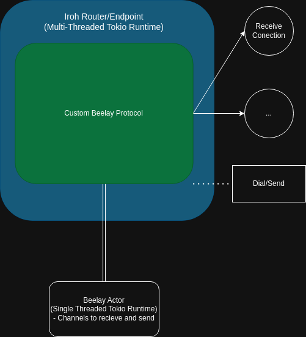
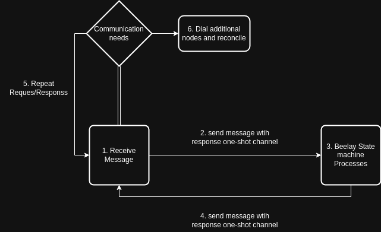

# Custom Iroh Protocol for Beelay/Keyhive

## Goal
This library's goal is to wrap the functionality of the early Beelay/Keyhive protocols to showcase a custom Iroh Protocol.  Using Iroh as the network layer, synchronization of Beelay state is achieved across Iroh nodes to exchange messages.

*Note: Currently the storage mechanism remains a Btree as used in the Beelay testing architecture*

## Top Level Design

An Iroh Endpoint/Router is created with a custom protocol to define the interactions with Beelay.  
* When spawned, the Iroh enpdpoint and the Beelay state machine share the same Key to identify them.
* Iroh runs in a multithreaded tokio runtime, but Beelay contains many RC values making it non-sendable.  It must run in a separate single threaded tokio runtime.  Communication with this Beelay actor occurs over a channel where Beelay is always receiving messages asynchronously.
* Upon receiving a connection request, Iroh creates a task/future that runs the acceptance handler.  This runs in a loop until the sender terminates the connection.  Messages will be sent back and forth until Beelay's state is satisfied.  It is possible to dial out to other nodes.  A future is spawned to handle dialing using the Iroh endpoint and engaging in a separate response/request cycle.

## Message Workflow

Received messages initiate this diagramed process.  A few things to note:  
* Messages arrive in a serialized form of a different type than Beelay expects.  There are multiple types we need to relay that can be serialized but do not have the serialization traits from serde defined on them.  We therefore have an enum that acts as a relay to/from the real Message type to allow sending messages across the wire.
* Several types within Beelay contain RCs which cannot be sent outside the Beelay Actor, so new types were created to allow this data to move between threads (though they can be effectively converted to bytes, no consequences have been observed...).  
* There is an interface on the belay actor to translate all outside actions using an enum handler into message-passing requests to the Beelay Actor using a oneshot channel.  All newtypes are translated appropriately for the final calls in the BeelayWrapper.